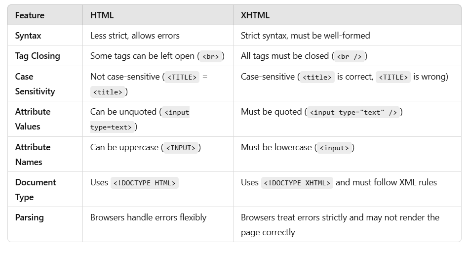

🤔 meta tags ?

🅰️ Why Meta Tags?
    Meta tags in HTML are essential for providing metadata about a webpage. They help search engines understand the page's content, improve SEO (Search Engine Optimization), and control how the page is displayed in search results or social media previews.

    How Do Meta Tags Work?
    Meta tags are placed inside the <head> section of an HTML document. They do not appear on the webpage but provide crucial information to browsers, search engines, and social media platforms. They use the <meta> element with attributes like name, content, and charset.

    What Are Meta Tags?
    Meta tags are HTML elements that define metadata for a webpage. Some common meta tags include:

    Charset Meta Tag <meta charset="UTF-8">
    Viewport Meta Tag <meta name="viewport" content="width=device-width, initial-scale=1.0">
    Description Meta Tag <meta name="description" content="This is a sample webpage about HTML meta tags.">
    Keywords Meta Tag <meta name="keywords" content="HTML, meta tags, SEO, web development">
    Author Meta Tag  <meta name="author" content="John Doe">

----------------------------------------------------------------------------------------------------------------------------
🤔 semantic tags ?

🅰️ Why Semantic Tags?
    Semantic tags were introduced in HTML5 to improve the readability and structure of web pages. Before HTML5, developers used 
 and  for everything, making it hard to understand the page’s content.

    Better Readability: Code is more understandable for developers.
    SEO Friendly: Search engines can interpret page content more accurately

    How Do Semantic Tags Work?
    Semantic tags describe the purpose of the content inside them.

    Unlike 
 (which is generic), semantic elements clearly indicate their meaning.
    Browsers and search engines process them differently to improve accessibility and SEO.
    Example: Instead of using 
, use <header>.

    What Are Semantic Tags?
    Semantic tags convey meaning about their content. Some common semantic tags include:

    Tag	            Purpose
    <header>	    Represents the header of a webpage or section.
    <nav>	        Defines a navigation menu.
    <section>	    Groups related content.
    <article>	    Represents an independent piece of content.
    <aside>	        Contains additional information (like sidebars).
    <footer>	    Defines the footer of a page or section.
    <figure>	    Groups media content like images, videos, or captions.
    <main>	        Defines the primary content of a webpage.
    <mark>	        Highlights important text.

----------------------------------------------------------------------------------------------------------------------------
🤔 Difference between HTML & XHTML ?

🅰️ Why Was XHTML Introduced?
    HTML (HyperText Markup Language) was widely used but was not strict about syntax, leading to inconsistent webpages.
    XHTML (Extensible HyperText Markup Language) was introduced as a stricter, XML-compliant version of HTML.
    It ensures better structure, consistency, and compatibility with other XML-based applications.

    How Does XHTML Differ from HTML?
    XHTML follows stricter rules than HTML.
    It is case-sensitive, requires well-formed code, and needs proper closing of tags.

    HTML (Allowed) 
    
    XHTML (Strict, Requires Closing Tag)  

    What Is the Difference Between HTML & XHTML?
    
----------------------------------------------------------------------------------------------------------------------------
Q. How does HTML DOM  model work ?

----------------------------------------------------------------------------------------------------------------------------
Q. custom data attributes ?

----------------------------------------------------------------------------------------------------------------------------
Q. Lazy loading in HTML ?

----------------------------------------------------------------------------------------------------------------------------
Q. Difference between 
 and <section> ?

----------------------------------------------------------------------------------------------------------------------------
Q. defer attribute work in a <script> How is it Difference from async ?

----------------------------------------------------------------------------------------------------------------------------
Q. Different types of Input Element ?

----------------------------------------------------------------------------------------------------------------------------
Q. Different ways to include external resources in (css, JS) in HTML ?

----------------------------------------------------------------------------------------------------------------------------
Q. <head> <body> <main> ?

----------------------------------------------------------------------------------------------------------------------------
Q. Difference between action, method attributes of a <form> tag ?

----------------------------------------------------------------------------------------------------------------------------
Q. <no script> tag ?

----------------------------------------------------------------------------------------------------------------------------
Q. Difference between id & class attributes ?

----------------------------------------------------------------------------------------------------------------------------
Q. DangeourslySetHTML ?

----------------------------------------------------------------------------------------------------------------------------